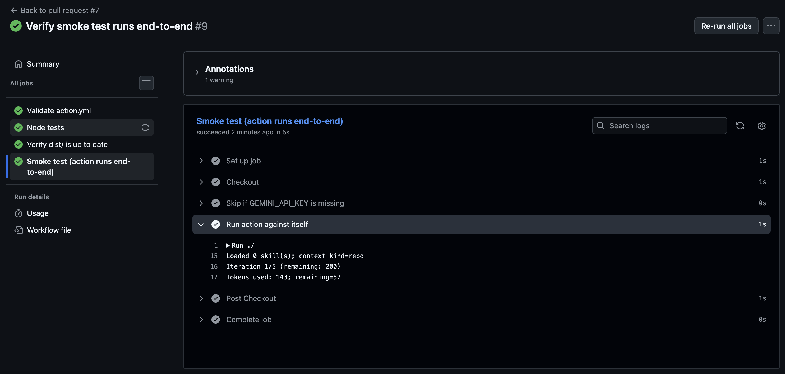

# Flash 3.5 Action

GitHub Action that runs Gemini 3.5 Flash on your repo. Skills-aware. Cost-capped. Honest.

[](https://github.com/dariomonopoli-dev/flash-3.5-action/releases)
[](LICENSE)
[](https://github.com/marketplace/actions/flash-3-5-action)
[](https://nodejs.org/)



Flash 3.5 Action runs Gemini 3.5 Flash against your repository as a GitHub Action, handling PR review, issue triage, changelog generation, dependency audits, and content-based labeling from a single workflow step. It is built for teams migrating off `google-github-actions/run-gemini-cli` before [Google's June 18, 2026 sunset](https://developers.googleblog.com/an-important-update-transitioning-gemini-cli-to-antigravity-cli/) of Gemini CLI for Google AI Pro, Ultra, and free Gemini Code Assist tiers, and for anyone who wants a lightweight Flash-specific runner with real cost controls. What sets it apart: skills auto-discovery from `.agent/skills/`, a hard token budget that aborts on overrun, native `AGENTS.md` support, and one configuration that works across Claude Code, Codex, and Antigravity 2.0.

> **Note**
> This is a JavaScript Action (not a composite action). It calls the Gemini 3.5 Flash API directly through `@google/genai`. It is intentionally **not** an Antigravity CLI wrapper — as of May 19, 2026, Antigravity CLI is closed-source and does not expose a headless mode suitable for CI. When that changes, this action will offer Antigravity CLI as an opt-in backend (see roadmap).

## Quick start

```yaml
# .github/workflows/pr-security-review.yml
name: PR Security Review

on:
  pull_request:
    types: [opened, synchronize, reopened]

jobs:
  review:
    runs-on: ubuntu-latest
    permissions:
      contents: read
      pull-requests: write
    steps:
      - uses: actions/checkout@v4
        with:
          fetch-depth: 0

      - uses: dariomonopoli-dev/flash-3.5-action@v1
        with:
          api-key: ${{ secrets.GEMINI_API_KEY }}
          prompt: |
            Review this pull request for security issues.
            Focus on injection, auth, secrets, and unsafe deserialization.
          context: pr
          output: comment
          max-tokens: 8000
```

That's it. The action checks out the PR diff, runs Gemini 3.5 Flash with your prompt, and posts the result as a single PR comment. If the run exceeds `max-tokens`, it aborts cleanly with a `BudgetExceededError` instead of silently overrunning your bill.

## Why this exists

The Gemini CLI consumer sunset is **June 18, 2026**. Teams using `google-github-actions/run-gemini-cli` need a migration path. `run-gemini-cli` works fine for many teams, but it is a composite action that installs the full Gemini CLI on every run — heavy, slow, and tied to the entire CLI feature set. Flash 3.5 Action is the lightweight, Flash-focused alternative: a single bundled `dist/index.js`, no CLI install, no Node version mismatch surprises, hard cost ceilings, and an interface designed around the workflows people actually run in CI (PR review, triage, changelog, audit, labeling).

## Comparison

|  | flash-3.5-action | google-github-actions/run-gemini-cli |
|---|---|---|
| Action type | JS Action (bundled) | Composite |
| Cold start | ~2s (single `dist/index.js`) | ~30-60s (full Gemini CLI install) |
| Token budget enforcement | Hard cap, run aborts | None |
| Default model | `gemini-3.5-flash` | `gemini-2.5-pro` |
| Skills (`.agent/skills/`) | Auto-discovered | Not native |
| `AGENTS.md` | First-class | Not native |
| Cross-tool config | One `AGENTS.md` works in Claude Code, Codex, Antigravity 2.0 | Tied to Gemini CLI |
| Footprint | ~1MB bundled | ~150MB npm install |
| License | Apache-2.0 | Apache-2.0 |
| Maintainer | Community | Google |

If you need Vertex AI, Workload Identity Federation, or the full Gemini CLI extension catalog, stay on `run-gemini-cli` for now. Those are on the roadmap but not yet supported here. See [docs/migration-from-gemini-cli.md](docs/migration-from-gemini-cli.md) for the full input-by-input mapping.

## Inputs

| Name | Required | Default | Description |
|---|---|---|---|
| `api-key` | yes | — | Gemini API key. Store as a repo secret (typically `GEMINI_API_KEY`). Never log this value. |
| `prompt` | yes | — | The instruction handed to the agent. Supports multi-line YAML. Skill bodies and `AGENTS.md` are appended automatically. |
| `context` | no | `auto` | One of `pr`, `issue`, `files`, `repo`, `none`, `auto`. `auto` infers from the triggering event. |
| `output` | no | `comment` | One of `comment`, `summary`, `check`, `file`, `none`. Pair `file` with `actions/upload-artifact` to upload to the Actions artifact store. |
| `output-file` | no | `flash-output.md` | Path used when `output` is `file`. Relative to the workspace. |
| `model` | no | `gemini-3.5-flash` | Model ID. Override only if you have access to a newer Flash variant. |
| `max-tokens` | no | `8000` | Hard budget cap on total tokens (prompt + response + thinking). Preflight aborts before the first call if estimated input already exceeds the cap; otherwise overruns are capped at one final completion. |
| `thinking-budget` | no | _model default_ | Thinking-token cap for Gemini 2.5+/3.x flash models. `0` disables thinking for predictable cost. `-1` lets the model decide. Positive integer caps thinking at that many tokens. |
| `skills` | no | `.agent/skills` | Directory of `SKILL.md` files. Auto-discovered and made available to the agent on request. |
| `agents-md` | no | `AGENTS.md` | Path to the `AGENTS.md` file. Injected as a system message if present. |
| `pr-number` | no | from event | Override the PR number resolved from the triggering event. |
| `issue-number` | no | from event | Override the issue number resolved from the triggering event. |
| `github-token` | no | `${{ github.token }}` | Token used for PR comments and check runs. |

## Outputs

| Name | Description |
|---|---|
| `summary` | Full text response from the agent. |
| `error` | Error message if the run failed. Empty string on success. |
| `artifact-path` | Path to the file written when `output: file`. Pair with `actions/upload-artifact` to upload. |
| `tokens-used` | Total tokens consumed across all iterations. |
| `budget-remaining` | `max-tokens` minus `tokens-used`. Useful for follow-up steps. |

## Auth

You need a Gemini API key. Get one from [https://aistudio.google.com/apikey](https://aistudio.google.com/apikey), then add it as a repository secret named `GEMINI_API_KEY`:

1. Go to your repo on GitHub → **Settings** → **Secrets and variables** → **Actions**.
2. Click **New repository secret**.
3. Name: `GEMINI_API_KEY`. Value: your key.
4. Reference it in workflows as `${{ secrets.GEMINI_API_KEY }}`.

`GITHUB_TOKEN` is provided automatically by GitHub Actions — you do not need to configure it unless you want to use a PAT with broader scopes. The default token has the permissions defined in your workflow's `permissions:` block.

## Examples

Five complete workflows live in [`examples/`](examples/). Copy any of them into `.github/workflows/` and adjust the prompt:

- [examples/pr-security-review.yml](examples/pr-security-review.yml) — Security-focused PR review on every open/sync.
- [examples/issue-triage.yml](examples/issue-triage.yml) — Auto-classifies and labels new issues.
- [examples/changelog-from-prs.yml](examples/changelog-from-prs.yml) — Generates CHANGELOG sections from merged PRs.
- [examples/weekly-dependency-audit.yml](examples/weekly-dependency-audit.yml) — Scheduled dependency vulnerability audit.
- [examples/auto-label-by-content.yml](examples/auto-label-by-content.yml) — Labels issues by content using a controlled allowlist.

## Skills and AGENTS.md

Skills are short, named instructions the agent can request mid-run. They live in `.agent/skills/<name>/SKILL.md` and follow the same format used by Anthropic's Skills system. The runner discovers them at startup, exposes their `name` and `description` to the agent, and only injects the body when the agent explicitly requests it.

### Sample skill

```markdown
---
name: security-review
description: Checklist-driven security review for pull requests. Use when reviewing diffs for vulnerabilities.
metadata:
  type: review
---

# Security Review

Review the provided diff against the following checklist. Cite specific lines.

## Injection
- SQL injection (string-concatenated queries)
- Command injection (shell calls with user input)
- Template injection (unescaped values in templates)

## Authentication and authorization
- Missing auth checks on new endpoints
- Hardcoded credentials or tokens
- Improper session handling

## Data handling
- Unsafe deserialization
- Path traversal in file operations
- PII logged in error messages

## Output format

Return a Markdown report with one section per finding. Severity must be one of:
CRITICAL, HIGH, MEDIUM, LOW. If no findings, return "No issues found."
```

### Sample AGENTS.md

`AGENTS.md` lives at the repo root and is injected as a system message on every run. It describes project conventions in one place, so the same file works with Claude Code, Codex, Antigravity 2.0, and this action.

```markdown
# AGENTS.md

## Project
Server-side TypeScript service. Node 20. Strict TS. ESM only.

## Conventions
- Immutable data structures. No in-place mutation.
- Errors thrown as typed classes, never plain strings.
- No `console.log` in shipped code — use the `logger` module.

## Review priorities
1. Correctness and type safety
2. Security (injection, auth, secrets)
3. Performance (N+1 queries, unbounded loops)
4. Readability

## Out of scope
- Style nits the formatter handles
- Speculative refactors not tied to the diff
```

### Skill loading protocol

The agent never sees skill bodies by default. To request a skill, the agent emits a self-closing tag on its own line:

```
<skill name="security-review"/>
```

The runner parses the tag, looks up the skill, and appends the skill body to the user prompt for the next iteration under a `## Skill: <name>` markdown heading. This keeps the system prompt small and lets the agent pull in just what it needs.

## Cost controls

`max-tokens` is a **hard cap**, not a soft target. Enforcement happens in two places:

1. **Preflight** — before the first API call, the runner estimates input tokens from `systemPrompt + userPrompt` using a 4-chars/token heuristic. If the estimate already exceeds the cap, the run aborts before any billing.
2. **Per-iteration** — after each model call the runner records the API-reported token usage. If the running total crosses the cap, the next iteration is skipped and the loop exits with a `BudgetExceededError`.

The runner counts **all three** billable token categories: prompt input, visible response, and hidden "thinking" tokens used by Gemini 2.5+/3.x flash models. The cost guard reads `responseTokenCount` and `thoughtsTokenCount` from the API's usage metadata, so the reported `tokens-used` matches what Google bills.

What this means in practice: the *last* call that tips the budget is **not** aborted before it runs — a synchronous API can't be cancelled mid-flight. But every subsequent call is suppressed, so a runaway loop is capped to one over-budget completion at most.

For the most predictable cost, set `thinking-budget: 0` to disable the thinking phase entirely. For code review and triage tasks where reasoning quality matters, leave it at the model default and accept that thinking can consume up to half the response budget.

### Verified numbers

Same 25-token prompt ("In one sentence: what is a GitHub Action?") against `gemini-3.5-flash`:

| Mode | Latency | Prompt | Response | Thinking | Total billed |
|---|---|---|---|---|---|
| `thinking-budget` unset (model default) | 2.16s | 25 | 40 | 295 | **360** |
| `thinking-budget: 0` (disabled) | 0.97s | 25 | 38 | 0 | **63** |
| `thinking-budget` unset (second run) | 2.38s | 25 | 38 | 367 | **430** |

Disabling thinking made this particular task **~2.2× faster** and **~5.7× cheaper** with no measurable quality difference. Use `thinking-budget: 0` for fixed-allowlist labeling and templated summaries; leave it at the default for PR review and triage where reasoning helps.

The `BudgetExceededError` carries `used` and `budget` fields and produces a message like `Token budget exceeded: 8210 > 8000`.

Two outputs are always populated, even on abort:

- `tokens-used` — total tokens across all iterations
- `budget-remaining` — `max-tokens` - `tokens-used`, clamped at 0

This makes it straightforward to graph spend in a dashboard or fail downstream steps when a run gets close to the ceiling.

## Migration from `run-gemini-cli`

For most workflows, migration is a one-line change:

```diff
- uses: google-github-actions/run-gemini-cli@v0
+ uses: dariomonopoli-dev/flash-3.5-action@v1
```

Input names differ slightly (`gemini_api_key` → `api-key`, `gemini_model` → `model`). The full mapping, side-by-side YAML diffs for the top three use cases, and a list of features that do not yet map are in [docs/migration-from-gemini-cli.md](docs/migration-from-gemini-cli.md).

## Roadmap

Honest about scope. No promises on dates beyond the June 18 deadline.

- **v0.2** — TypeScript migration, retries with exponential backoff, response streaming.
- **v0.3** — Native artifact format that mirrors Antigravity task artifacts (so the same output works across runners).
- **v0.4** — Dynamic subagent orchestration (`<subagent .../>` tags with isolated context windows).
- **v1.0** — Optional Antigravity CLI binary backend, switchable via `backend:` input, when `--headless` ships.

Things deliberately out of scope until they prove necessary:

- A bespoke plugin marketplace. `AGENTS.md` plus skills covers most of what plugins do, and stays portable across tools.
- A streaming UI for action logs. GitHub's log viewer is sufficient.
- Multi-model routing. If you want Pro, use Pro. This action is Flash-focused on purpose.

## Contributing

PRs welcome. See [CONTRIBUTING.md](CONTRIBUTING.md) for local setup, build, and PR conventions. By participating you agree to the [Code of Conduct](CODE_OF_CONDUCT.md).

## License

Apache-2.0. See [LICENSE](LICENSE).

## Acknowledgments

- [`google-github-actions/run-gemini-cli`](https://github.com/google-github-actions/run-gemini-cli) is the structural reference for this action. Many of the input names and event-handling patterns mirror that project, on purpose, to make migration cheap.
- The `SKILL.md` format and skill-request protocol are adopted from Anthropic's Skills system.
- Not affiliated with Google, Anthropic, or any model provider. "Gemini" and related marks belong to their respective owners.


